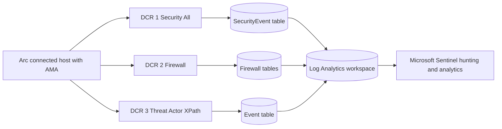
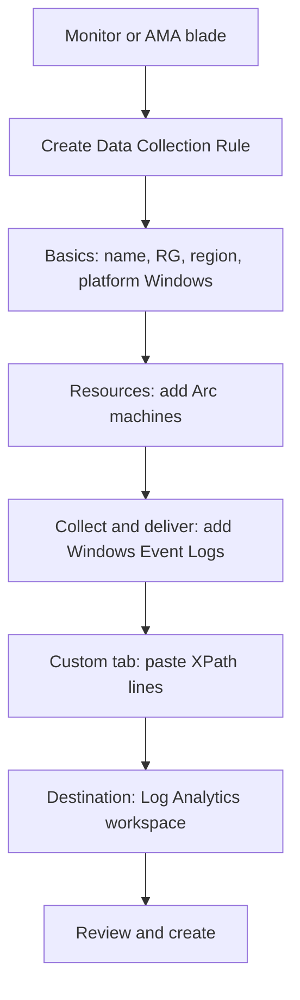

# DCR Creation: Threat Actor Focused Windows Event Collection via AMA

A field guide for building a second (and third) Data Collection Rule that
captures the Windows telemetry an attacker generates but that the
**Windows Security Events via AMA** connector and the **Windows Firewall via
AMA** connector leave on the floor. Written for SOC engineers standing up
Defender for Servers and Microsoft Sentinel for customers.

---

## 1. Who this is for and what it assumes

You already have these two connectors live on your Arc connected servers and
workstations:

| Connector | Tier you selected | Channel it owns | Table it fills |
| --- | --- | --- | --- |
| Windows Security Events via AMA | All Security Events | `Security` | `SecurityEvent` |
| Windows Firewall via AMA | n/a | `Microsoft-Windows-Windows Firewall With Advanced Security/*` | `ASimNetworkSessionLogs` and `WindowsFirewall` |

Those two cover authentication, privilege use, object access auditing, and
the firewall. They do **not** cover the operational channels where modern
intrusion activity actually shows up: PowerShell script blocks, WMI activity,
Task Scheduler, WinRM, AppLocker, Sysmon, DNS client, and BITS, to name the
heavy hitters.

This guide builds a **threat actor DCR** that collects those channels by
XPath, so you keep the working Security and Firewall collection untouched and
add hunting depth on top.



---

## 2. Why a separate DCR instead of the Custom tier

The Windows Security Events connector tiers (All, Common, Minimal, Custom)
are mutually exclusive radio buttons and they only target the `Security`
channel. The moment you switch that connector to Custom to bolt on other
channels, you risk narrowing the Security collection that is already working.

Keep them separate:

1. **DCR 1** stays on All Security Events. Do not touch it.
2. **DCR 2** stays on Windows Firewall. Do not touch it.
3. **DCR 3** is the new one you build here. It targets the operational
   channels by XPath. The same Arc machines get associated to all three.
   AMA merges the instructions and ships everything to the one workspace.

A host can carry many DCR associations at once. There is no conflict.

---

## 3. Where the data lands (this changes every KQL query you write)

This is the single most important fact in the guide.

| Source channel | Collected by | Lands in table | Hunt with column |
| --- | --- | --- | --- |
| `Security` | Security Events connector | `SecurityEvent` | `EventID` |
| Firewall channels | Firewall connector | Firewall tables | varies |
| Every other Windows channel (PowerShell, WMI, etc.) | this DCR | `Event` | `EventLog` and `EventID` |

Non Security Windows channels collected through the AMA Windows event log
data source land in the **`Event`** table, not `SecurityEvent`. In the
`Event` table:

- `EventLog` holds the channel name, for example
  `Microsoft-Windows-PowerShell/Operational`
- `EventID` is the numeric id (often arrives as a string, cast with `toint`)
- `RenderedDescription` holds the human readable message and, for things
  like PowerShell 4104, the decoded script content
- `ParameterXml` and `EventData` hold the raw structured fields

---

## 4. XPath primer: format, syntax, and how to test before you deploy

### 4.1 The DCR XPath format

Every line in a DCR is one expression in the form:

```
Channel!XPathQuery
```

- The part before `!` is the **channel name** exactly as it appears in Event
  Viewer (right click the log, Properties, the Full Name field).
- The part after `!` is an **XPath 1.0** query against that channel.
- To collect an entire channel unfiltered, use `*`:
  `Microsoft-Windows-PowerShell/Operational!*`
- To filter to specific event ids:
  `Microsoft-Windows-PowerShell/Operational!*[System[(EventID=4104)]]`
- To filter to several ids:
  `Channel!*[System[(EventID=4104 or EventID=4103)]]`
- To filter by level (1 critical, 2 error, 3 warning, 4 information):
  `Channel!*[System[(Level=2)]]`
- To filter by a time window (last hour, rarely used in DCRs):
  `Channel!*[System[TimeCreated[timediff(@SystemTime) <= 3600000]]]`

AMA accepts any XPath that `wevtutil` and `Get-WinEvent` accept. If a machine
does not have a given channel (for example PowerShell 7 is not installed),
AMA silently skips that line on that machine. No error, no broken DCR.

### 4.2 Test any XPath locally before you trust it

Run these on a representative host. If the query returns events, AMA will
collect them.

```powershell
# Validate an XPath returns events (PowerShell)
Get-WinEvent -LogName 'Microsoft-Windows-PowerShell/Operational' `
    -FilterXPath '*[System[(EventID=4104)]]' -MaxEvents 5

# Same idea with wevtutil (matches AMA parsing exactly)
wevtutil qe "Microsoft-Windows-PowerShell/Operational" `
    /q:"*[System[(EventID=4104)]]" /c:5 /rd:true /f:text
```

```powershell
# Confirm a channel even exists on the host before adding it
Get-WinEvent -ListLog 'Microsoft-Windows-PowerShell/Operational' |
    Select-Object LogName, IsEnabled, RecordCount
```

---

## 5. The threat actor XPath catalog

Organized by what the attacker is doing (loosely MITRE ATT&CK tactics). Each
entry gives you the channel, the event ids worth keeping, a ready to paste
DCR line, and whether you can **collect now** or must **enable first**.

> Legend
> **Collect now** means the channel logs by default, just collect it.
> **Enable first** means the channel is silent until you turn on an audit
> policy or feature (Section 6 has the scripts). Collecting it before you
> enable it returns nothing.

### 5.1 Execution: PowerShell

PowerShell is the most abused execution surface on Windows. Collect all three
channels.

```
Microsoft-Windows-PowerShell/Operational!*[System[(EventID=4103 or EventID=4104 or EventID=4105 or EventID=4106)]]
Windows PowerShell!*[System[(EventID=400 or EventID=403 or EventID=500 or EventID=501 or EventID=600 or EventID=800)]]
Microsoft-Windows-PowerShellCore/Operational!*[System[(EventID=4103 or EventID=4104)]]
```

| Event ID | Channel | What it reveals |
| --- | --- | --- |
| 4104 | PowerShell/Operational | Script block logging. The decoded command, even if it was obfuscated or base64. The crown jewel. **Enable first.** |
| 4103 | PowerShell/Operational | Module and pipeline execution detail. Collect now. |
| 4105 / 4106 | PowerShell/Operational | Script start and stop. Collect now. |
| 400 / 403 | Windows PowerShell (classic) | Engine start and stop, host version. Catches downgrade to v2. Collect now. |
| 500 / 501 / 600 | Windows PowerShell (classic) | Command invocation and provider lifecycle. Collect now. |
| 800 | Windows PowerShell (classic) | Pipeline execution details. Collect now. |

If you only collect everything, use the unfiltered form:

```
Microsoft-Windows-PowerShell/Operational!*
Windows PowerShell!*
Microsoft-Windows-PowerShellCore/Operational!*
```

### 5.2 Execution: Windows Management Instrumentation (WMI)

WMI is used for lateral movement, persistence, and fileless execution.

```
Microsoft-Windows-WMI-Activity/Operational!*[System[(EventID=5857 or EventID=5858 or EventID=5859 or EventID=5860 or EventID=5861)]]
```

| Event ID | What it reveals |
| --- | --- |
| 5857 | Provider load, including the binary that hosted it. Collect now. |
| 5858 | WMI query errors, useful for failed recon. Collect now. |
| 5859 / 5860 / 5861 | Permanent event subscriptions, the classic WMI persistence (filter, consumer, binding). Collect now. |

### 5.3 Execution and lateral movement: Task Scheduler

```
Microsoft-Windows-TaskScheduler/Operational!*[System[(EventID=106 or EventID=140 or EventID=141 or EventID=200 or EventID=201)]]
```

| Event ID | What it reveals |
| --- | --- |
| 106 | New scheduled task registered. Persistence. Collect now (channel may need enabling on some builds). |
| 140 / 141 | Task updated or deleted. Collect now. |
| 200 / 201 | Task action executed and completed, shows the binary run. Collect now. |

### 5.4 Lateral movement: WinRM and remote PowerShell

```
Microsoft-Windows-WinRM/Operational!*[System[(EventID=6 or EventID=91 or EventID=168 or EventID=169)]]
```

| Event ID | What it reveals |
| --- | --- |
| 6 | WSMan session created (client side remoting). Collect now. |
| 91 | Server side shell created. Inbound remoting. Collect now. |
| 168 / 169 | Authentication on the WinRM listener, ties remoting to an account. Collect now. |

### 5.5 Execution control and bypass: AppLocker and WDAC

```
Microsoft-Windows-AppLocker/EXE and DLL!*
Microsoft-Windows-AppLocker/MSI and Script!*
Microsoft-Windows-AppLocker/Packaged app-Execution!*
Microsoft-Windows-CodeIntegrity/Operational!*[System[(EventID=3076 or EventID=3077 or EventID=3033)]]
```

| Event ID | Channel | What it reveals |
| --- | --- | --- |
| 8003 / 8004 | AppLocker EXE and DLL | Would have blocked or did block an executable. Catches LOLBins. **Enable first** (needs AppLocker policy). |
| 8006 / 8007 | AppLocker MSI and Script | Script and installer control. Enable first. |
| 3076 / 3077 | CodeIntegrity/Operational | WDAC audit and enforcement of unsigned or untrusted code. Enable first. |
| 3033 | CodeIntegrity/Operational | Code integrity check failed. Enable first. |

### 5.6 The gold standard: Sysmon

If you deploy Sysmon (System Monitor from Sysinternals), this one channel
gives process creation with command line and hashes, network connections,
image loads, registry tamper, named pipes, and WMI events. Collect the whole
channel.

```
Microsoft-Windows-Sysmon/Operational!*
```

| Sysmon Event ID | What it reveals |
| --- | --- |
| 1 | Process creation with full command line, hashes, parent. The backbone of host hunting. |
| 3 | Network connection by process. |
| 7 | Image (DLL) loaded, catches sideloading. |
| 8 | CreateRemoteThread, classic injection. |
| 10 | Process access, catches LSASS credential theft attempts. |
| 11 | File create. |
| 12 / 13 / 14 | Registry create, set, and rename, catches persistence and tamper. |
| 13 | Registry value set (Run keys, etc.). |
| 17 / 18 | Named pipe create and connect, catches C2 frameworks. |
| 22 | DNS query by process. |
| 25 | Process tampering (process hollowing). |

Sysmon needs to be installed and configured first. It is **enable first**,
but it is the highest value channel you can add.

### 5.7 Persistence and defense evasion: services and drivers

```
System!*[System[Provider[@Name='Service Control Manager'] and (EventID=7045 or EventID=7036 or EventID=7040)]]
System!*[System[Provider[@Name='Microsoft-Windows-Kernel-PnP'] and (EventID=400 or EventID=410)]]
```

| Event ID | What it reveals |
| --- | --- |
| 7045 | New service installed. PsExec, Cobalt Strike, and most lateral movement leave this. Collect now. |
| 7036 / 7040 | Service state change and start type change, catches disabling defenses. Collect now. |

Note the provider filter. The `System` channel is huge, so you scope it to
the providers that matter instead of taking the whole thing.

### 5.8 Defense evasion: Windows Defender and tampering

```
Microsoft-Windows-Windows Defender/Operational!*[System[(EventID=5001 or EventID=5007 or EventID=1116 or EventID=1117 or EventID=5010 or EventID=5012)]]
```

| Event ID | What it reveals |
| --- | --- |
| 5001 | Real time protection disabled. Tampering. Collect now. |
| 5007 | Defender configuration changed (exclusions added). Collect now. |
| 5010 / 5012 | Antivirus scanning disabled. Collect now. |
| 1116 / 1117 | Malware detected and action taken. Collect now. |

### 5.9 Defense evasion: log clearing

```
Microsoft-Windows-Eventlog/Operational!*[System[(EventID=1102 or EventID=104)]]
```

| Event ID | Channel | What it reveals |
| --- | --- | --- |
| 1102 | Security (also surfaces here) | The Security log was cleared. A loud anti forensics signal. Collect now. |
| 104 | System / Eventlog | An event log was cleared. Collect now. |

### 5.10 Command and control: BITS and DNS client

```
Microsoft-Windows-Bits-Client/Operational!*[System[(EventID=3 or EventID=59 or EventID=60 or EventID=16403)]]
Microsoft-Windows-DNS-Client/Operational!*[System[(EventID=3008 or EventID=3020)]]
```

| Event ID | Channel | What it reveals |
| --- | --- | --- |
| 3 / 59 / 60 | BITS-Client | BITS transfer created and the remote URL. Catches stealthy download and exfil. Collect now. |
| 16403 | BITS-Client | BITS job carried on across reboot, common in malware. Collect now. |
| 3008 | DNS-Client | DNS query made and the name resolved. Catches DGA and C2 domains. **Enable first** on some builds. |
| 3020 | DNS-Client | DNS response. Enable first. |

### 5.11 Credential access: SMB and NTLM

```
Microsoft-Windows-SMBServer/Security!*[System[(EventID=551 or EventID=1009)]]
Microsoft-Windows-NTLM/Operational!*
```

| Event ID | Channel | What it reveals |
| --- | --- | --- |
| 551 | SMBServer/Security | SMB authentication failure, catches password spray over SMB. Collect now. |
| NTLM events | NTLM/Operational | Outgoing and incoming NTLM, catches relay and downgrade. **Enable first** (NTLM auditing). |

### 5.12 Discovery and remote services: RDP and Terminal Services

```
Microsoft-Windows-TerminalServices-RemoteConnectionManager/Operational!*[System[(EventID=1149)]]
Microsoft-Windows-TerminalServices-LocalSessionManager/Operational!*[System[(EventID=21 or EventID=24 or EventID=25)]]
```

| Event ID | Channel | What it reveals |
| --- | --- | --- |
| 1149 | RemoteConnectionManager | RDP authentication succeeded at the network layer, shows source IP before logon. Collect now. |
| 21 / 24 / 25 | LocalSessionManager | RDP session logon, disconnect, and reconnect with user and source. Collect now. |

---

## 6. Prerequisites: turn the silent channels on first

Several of the highest value channels above produce nothing until you enable
the underlying audit policy or feature. Collecting them before enabling wastes
a DCR line and gives a false sense of coverage. Enable these by Group Policy
for the fleet; the scripts below are for a single host to validate, and as a
fallback.

### 6.1 PowerShell script block logging (for 4104)

```powershell
# Check whether script block logging is on
$p = 'HKLM:\SOFTWARE\Policies\Microsoft\Windows\PowerShell\ScriptBlockLogging'
if (Test-Path $p) {
    (Get-ItemProperty -Path $p).EnableScriptBlockLogging
} else {
    'Not configured'
}
```

```powershell
# Enable script block logging (prefer GPO for the fleet)
$p = 'HKLM:\SOFTWARE\Policies\Microsoft\Windows\PowerShell\ScriptBlockLogging'
New-Item -Path $p -Force | Out-Null
New-ItemProperty -Path $p -Name 'EnableScriptBlockLogging' `
    -Value 1 -PropertyType DWord -Force | Out-Null
```

GPO path: Computer Configuration, Administrative Templates, Windows
Components, Windows PowerShell, Turn on PowerShell Script Block Logging.

### 6.2 PowerShell module logging (for 4103)

GPO path: Computer Configuration, Administrative Templates, Windows
Components, Windows PowerShell, Turn on Module Logging. Set module names to
`*` to log all.

### 6.3 DNS client operational channel (for 3008 and 3020)

```powershell
# Enable the DNS-Client operational log
wevtutil sl "Microsoft-Windows-DNS-Client/Operational" /e:true
```

### 6.4 NTLM auditing (for the NTLM channel)

GPO path: Computer Configuration, Windows Settings, Security Settings, Local
Policies, Security Options. Set the three Network security: Restrict NTLM
auditing policies to Enable auditing for all accounts.

### 6.5 AppLocker (for 8003 and 8004)

AppLocker must have at least an audit only policy applied through GPO before
its channels log anything. Start in Audit only mode so you see would have
blocked events without breaking applications.

### 6.6 Sysmon (for the Sysmon channel)

Install Sysmon with a curated configuration (a well maintained community base
config is a good start, then tune). Sysmon creates and writes its own
operational channel once installed.

```powershell
# Confirm Sysmon is installed and the channel exists
Get-WinEvent -ListLog 'Microsoft-Windows-Sysmon/Operational' -ErrorAction SilentlyContinue |
    Select-Object LogName, IsEnabled, RecordCount
```

---

## 7. Recommended starting set

For most customers, start with this **collect now** set on day one (no
prerequisites), then layer in the **enable first** channels as you turn on the
audit policies. Paste these straight into the DCR.

```
Microsoft-Windows-PowerShell/Operational!*[System[(EventID=4103 or EventID=4104 or EventID=4105 or EventID=4106)]]
Windows PowerShell!*[System[(EventID=400 or EventID=403 or EventID=500 or EventID=600 or EventID=800)]]
Microsoft-Windows-WMI-Activity/Operational!*[System[(EventID=5857 or EventID=5858 or EventID=5859 or EventID=5860 or EventID=5861)]]
Microsoft-Windows-TaskScheduler/Operational!*[System[(EventID=106 or EventID=140 or EventID=141 or EventID=200 or EventID=201)]]
Microsoft-Windows-WinRM/Operational!*[System[(EventID=6 or EventID=91 or EventID=168 or EventID=169)]]
System!*[System[Provider[@Name='Service Control Manager'] and (EventID=7045 or EventID=7036 or EventID=7040)]]
Microsoft-Windows-Windows Defender/Operational!*[System[(EventID=5001 or EventID=5007 or EventID=1116 or EventID=1117 or EventID=5010 or EventID=5012)]]
Microsoft-Windows-Eventlog/Operational!*[System[(EventID=1102 or EventID=104)]]
Microsoft-Windows-Bits-Client/Operational!*[System[(EventID=3 or EventID=59 or EventID=60 or EventID=16403)]]
Microsoft-Windows-TerminalServices-RemoteConnectionManager/Operational!*[System[(EventID=1149)]]
Microsoft-Windows-TerminalServices-LocalSessionManager/Operational!*[System[(EventID=21 or EventID=24 or EventID=25)]]
```

Then, once enabled, add:

```
Microsoft-Windows-Sysmon/Operational!*
Microsoft-Windows-AppLocker/EXE and DLL!*
Microsoft-Windows-AppLocker/MSI and Script!*
Microsoft-Windows-CodeIntegrity/Operational!*[System[(EventID=3076 or EventID=3077 or EventID=3033)]]
Microsoft-Windows-DNS-Client/Operational!*[System[(EventID=3008 or EventID=3020)]]
Microsoft-Windows-NTLM/Operational!*
```

---

## 8. Build the DCR in the Azure portal (click path)



1. Go to **Monitor**, then **Data Collection Rules**, then **Create**.
2. **Basics**. Name it clearly, for example `dcr-threat-actor-events`.
   Resource group: your SOC resource group. Region: match the workspace
   region. Platform Type: **Windows**.
3. **Resources**. Add the Arc connected servers and workstations. The same
   machines already carrying DCR 1 and DCR 2 can be added here too.
4. **Collect and deliver**. Add a data source, type **Windows Event Logs**.
5. Switch to the **Custom** (XPath) entry mode and paste your lines from
   Section 7, one expression per row. The portal validates each line.
6. **Destination**. Choose Azure Monitor Logs and select your Log Analytics
   workspace.
7. **Review and create**.

Within a few minutes the Arc machines pull the new instructions and start
shipping to the `Event` table.

---

## 9. Build the DCR as an ARM template (repeatable for customers)

Use this when you want the DCR in source control and deployed the same way
across tenants. Replace the placeholder values. The example uses the
SOC-Central lab values as a reference.

```jsonc
{
  "$schema": "https://schema.management.azure.com/schemas/2019-04-01/deploymentTemplate.json#",
  "contentVersion": "1.0.0.0",
  "parameters": {
    "dcrName":        { "type": "string", "defaultValue": "dcr-threat-actor-events" },
    "location":       { "type": "string", "defaultValue": "eastus" },
    "workspaceResourceId": {
      "type": "string",
      "defaultValue": "/subscriptions/<subscription-id>/resourceGroups/SOC-Central/providers/Microsoft.OperationalInsights/workspaces/<your-workspace-name>"
    }
  },
  "resources": [
    {
      "type": "Microsoft.Insights/dataCollectionRules",
      "apiVersion": "2022-06-01",
      "name": "[parameters('dcrName')]",
      "location": "[parameters('location')]",
      "kind": "Windows",
      "properties": {
        "dataSources": {
          "windowsEventLogs": [
            {
              "name": "threatActorEvents",
              "streams": [ "Microsoft-Event" ],
              "xPathQueries": [
                "Microsoft-Windows-PowerShell/Operational!*[System[(EventID=4103 or EventID=4104 or EventID=4105 or EventID=4106)]]",
                "Windows PowerShell!*[System[(EventID=400 or EventID=403 or EventID=500 or EventID=600 or EventID=800)]]",
                "Microsoft-Windows-WMI-Activity/Operational!*[System[(EventID=5857 or EventID=5858 or EventID=5859 or EventID=5860 or EventID=5861)]]",
                "Microsoft-Windows-TaskScheduler/Operational!*[System[(EventID=106 or EventID=140 or EventID=141 or EventID=200 or EventID=201)]]",
                "Microsoft-Windows-WinRM/Operational!*[System[(EventID=6 or EventID=91 or EventID=168 or EventID=169)]]",
                "System!*[System[Provider[@Name='Service Control Manager'] and (EventID=7045 or EventID=7036 or EventID=7040)]]",
                "Microsoft-Windows-Windows Defender/Operational!*[System[(EventID=5001 or EventID=5007 or EventID=1116 or EventID=1117 or EventID=5010 or EventID=5012)]]",
                "Microsoft-Windows-Eventlog/Operational!*[System[(EventID=1102 or EventID=104)]]",
                "Microsoft-Windows-Bits-Client/Operational!*[System[(EventID=3 or EventID=59 or EventID=60 or EventID=16403)]]",
                "Microsoft-Windows-TerminalServices-RemoteConnectionManager/Operational!*[System[(EventID=1149)]]",
                "Microsoft-Windows-TerminalServices-LocalSessionManager/Operational!*[System[(EventID=21 or EventID=24 or EventID=25)]]"
              ]
            }
          ]
        },
        "destinations": {
          "logAnalytics": [
            {
              "name": "sentinelWorkspace",
              "workspaceResourceId": "[parameters('workspaceResourceId')]"
            }
          ]
        },
        "dataFlows": [
          {
            "streams": [ "Microsoft-Event" ],
            "destinations": [ "sentinelWorkspace" ]
          }
        ]
      }
    }
  ]
}
```

Validate before you deploy (the agent does not deploy for you, run this
yourself):

```powershell
az deployment group validate `
  --resource-group SOC-Central `
  --template-file dcr-threat-actor-events.json
```

After it exists, associate each Arc machine to the DCR. In the portal this is
on the DCR's Resources tab. With CLI it is a
`Microsoft.Insights/dataCollectionRuleAssociations` resource scoped to each
`Microsoft.HybridCompute/machines` resource.

---

## 10. Validate with KQL

Give the DCR a few minutes after association, then run these in Sentinel Logs
or Log Analytics.

```kql
// Did anything from the new DCR arrive, and from which channels
Event
| where TimeGenerated > ago(1h)
| summarize Events = count() by EventLog, Computer
| order by Events desc
```

```kql
// PowerShell script block content (the decoded commands)
Event
| where EventLog == "Microsoft-Windows-PowerShell/Operational" and EventID == 4104
| project TimeGenerated, Computer, RenderedDescription
| order by TimeGenerated desc
```

```kql
// New service installs (lateral movement and persistence)
Event
| where EventLog == "System" and EventID == 7045
| project TimeGenerated, Computer, RenderedDescription
| order by TimeGenerated desc
```

```kql
// WMI permanent event subscription persistence
Event
| where EventLog == "Microsoft-Windows-WMI-Activity/Operational"
| where EventID in (5859, 5860, 5861)
| project TimeGenerated, Computer, EventID, RenderedDescription
| order by TimeGenerated desc
```

```kql
// Suspicious script block patterns, a starter hunt
Event
| where EventLog == "Microsoft-Windows-PowerShell/Operational" and EventID == 4104
| where RenderedDescription has_any (
    "FromBase64String", "DownloadString", "DownloadFile", "IEX",
    "Invoke-Expression", "EncodedCommand", "-enc", "Net.WebClient",
    "Reflection.Assembly", "VirtualAlloc", "AmsiUtils", "bypass", "hidden")
| project TimeGenerated, Computer, RenderedDescription
| order by TimeGenerated desc
```

```kql
// Confirm the exact channel strings that arrived (use if a query returns nothing)
Event
| where TimeGenerated > ago(1h)
| distinct EventLog
```

If a query returns nothing, check three things in order: the channel exists on
the host (Section 4.2), the underlying logging is enabled (Section 6), and the
DCR association is in place on that machine.

---

## 11. Volume and cost: collect with intent

The `Event` table is billed like any analytics table. Unfiltered channels can
be loud. Guidance:

- **Filter by event id** for noisy channels (PowerShell classic, System,
  Defender). The Section 7 starter set already does this.
- **Take Sysmon whole** if you run it, but tune the Sysmon config itself to
  drop noise at the source rather than in the DCR.
- **Avoid `Channel!*`** on `System` and `Application`. Always scope by
  provider and event id, as shown in Section 5.7.
- **Watch the first 24 hours** with this query, then trim anything that is
  pure noise:

```kql
Event
| where TimeGenerated > ago(24h)
| summarize Count = count() by EventLog, EventID
| order by Count desc
```

- Consider a **Basic Logs** or **Auxiliary** plan for very high volume, low
  query frequency channels if your retention strategy allows it.

---

## 12. Maintenance and handoff

- Keep the ARM template in source control so every customer gets the same
  baseline and you can diff changes over time.
- Re visit the catalog when you add a new capability (deploy Sysmon, turn on
  AppLocker), then add the matching XPath line and redeploy.
- Document for the customer which channels are **collect now** versus
  **enable first**, and which audit policies you turned on, so the coverage is
  reproducible and auditable.

---

## Appendix A: Channel name quick reference

| Friendly name | Channel full name (use before the `!`) |
| --- | --- |
| PowerShell operational | `Microsoft-Windows-PowerShell/Operational` |
| PowerShell classic | `Windows PowerShell` |
| PowerShell 7 | `Microsoft-Windows-PowerShellCore/Operational` |
| WMI activity | `Microsoft-Windows-WMI-Activity/Operational` |
| Task Scheduler | `Microsoft-Windows-TaskScheduler/Operational` |
| WinRM | `Microsoft-Windows-WinRM/Operational` |
| AppLocker EXE and DLL | `Microsoft-Windows-AppLocker/EXE and DLL` |
| AppLocker MSI and Script | `Microsoft-Windows-AppLocker/MSI and Script` |
| Code Integrity (WDAC) | `Microsoft-Windows-CodeIntegrity/Operational` |
| Sysmon | `Microsoft-Windows-Sysmon/Operational` |
| Windows Defender | `Microsoft-Windows-Windows Defender/Operational` |
| BITS client | `Microsoft-Windows-Bits-Client/Operational` |
| DNS client | `Microsoft-Windows-DNS-Client/Operational` |
| SMB server security | `Microsoft-Windows-SMBServer/Security` |
| NTLM | `Microsoft-Windows-NTLM/Operational` |
| RDP connection manager | `Microsoft-Windows-TerminalServices-RemoteConnectionManager/Operational` |
| RDP session manager | `Microsoft-Windows-TerminalServices-LocalSessionManager/Operational` |
| System (scoped) | `System` |

## Appendix B: ATT&CK quick map

| Channel and key ids | Primary ATT&CK tactic |
| --- | --- |
| PowerShell 4104 / 4103 | Execution (T1059.001) |
| WMI 5857 to 5861 | Execution and Persistence (T1047, T1546.003) |
| Task Scheduler 106 / 200 | Persistence and Execution (T1053.005) |
| WinRM 6 / 91 | Lateral Movement (T1021.006) |
| Service Control Manager 7045 | Persistence and Lateral Movement (T1543.003, T1569.002) |
| Defender 5001 / 5007 | Defense Evasion (T1562.001) |
| Eventlog 1102 / 104 | Defense Evasion (T1070.001) |
| BITS 3 / 59 / 60 | Command and Control and Exfiltration (T1197) |
| DNS-Client 3008 | Command and Control (T1071.004) |
| NTLM channel | Credential Access and Lateral Movement (T1550, T1557.001) |
| RDP 1149 / 21 | Lateral Movement (T1021.001) |
| Sysmon 1 / 10 / 13 | Cross tactic host visibility |
