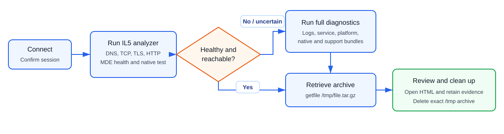
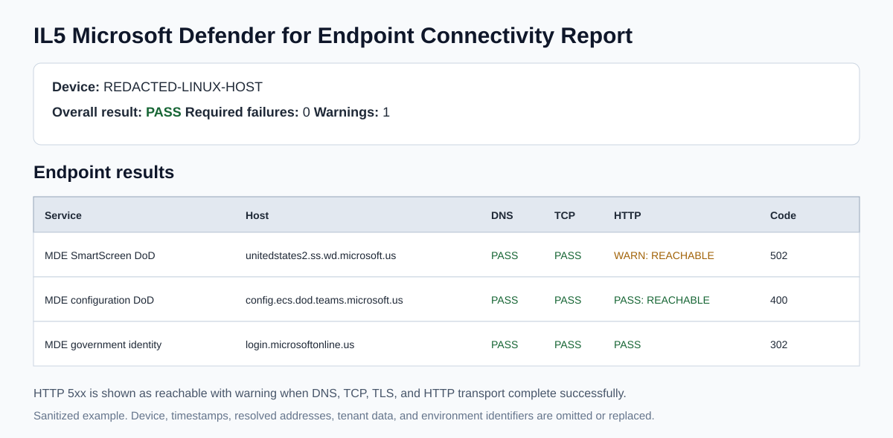
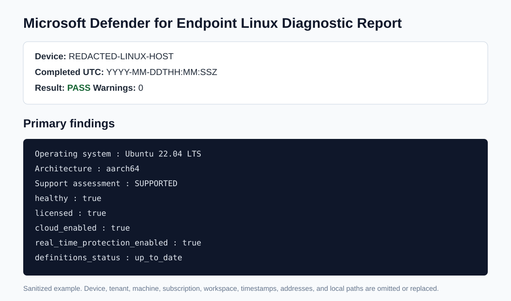

<h1 align="center">MDE Linux Live Response Troubleshooting Guide</h1>

<p align="center">
  <strong>Microsoft Defender for Endpoint | Linux | Live Response | DoD IL5</strong>
</p>

<p align="center">
  A self-contained guide for investigating connectivity, health, service, and command-execution problems on Linux devices.
</p>

| Guide information | Value |
|---|---|
| **Scope** | Supported Linux devices onboarded to MDE, including DoD IL5 / US Government |
| **MDE requirement** | Agent version `101.45.13` or later for Linux Live Response |
| **Primary workflow** | Connectivity analyzer first, full diagnostics when failed or uncertain |
| **Safety** | The supplied scripts are read only; `remediate` is destructive |
| **Validated** | September 29, 2026 |

> [!IMPORTANT]
> Live Response is not a normal Bash prompt. Enter only Live Response commands in the console. Run Linux commands through an uploaded Bash script with `run`. Always use `help <command>` to confirm the syntax exposed by the current service.

<details>
<summary><strong>Guide contents</strong></summary>

- [1. Prerequisites](#1-prerequisites)
- [2. Recommended troubleshooting workflow](#2-recommended-troubleshooting-workflow)
- [3. Every Live Response command supported on Linux](#3-every-live-response-command-supported-on-linux)
- [4. Live Response console techniques](#4-live-response-console-techniques)
- [5. Evidence checklist and decision points](#5-evidence-checklist-and-decision-points)
- [6. Built-in Linux MDE commands used by the collectors](#6-built-in-linux-mde-commands-used-by-the-collectors)
- [7. Session and file limits](#7-session-and-file-limits)
- [8. Fast troubleshooting matrix](#8-fast-troubleshooting-matrix)
- [9. Quick command reference](#9-quick-command-reference)
- [10. Escalation package](#10-escalation-package)
- [11. Microsoft references](#11-microsoft-references)

</details>

## Quick access

| Resource | Purpose |
|---|---|
| [Linux MDE Connectivity Analyzer for IL5](https://github.com/johnB007/Scripts/blob/main/Live%20Response/LinuxMDEConnectivityAnalyzer-IL5.sh) | Fast DNS, TCP, TLS, HTTP, native MDE, and IL5 endpoint validation |
| [MDE Linux Diagnostic Collector](https://github.com/johnB007/Scripts/blob/main/Live%20Response/Collect-MDELinuxDiagnostics.sh) | Full MDE, service, platform, log, native diagnostic, and support collection |
| [Microsoft Live Response documentation](https://learn.microsoft.com/defender-endpoint/live-response) | Current command support, prerequisites, behavior, and limits |
| [Microsoft Live Response command examples](https://learn.microsoft.com/defender-endpoint/live-response-command-examples) | Official command syntax examples |
| [MDE Linux Client Analyzer](https://learn.microsoft.com/defender-endpoint/run-analyzer-linux) | Microsoft support analyzer usage and output |
| [Supported MDE Linux distributions](https://learn.microsoft.com/defender-endpoint/mde-linux-prerequisites#supported-linux-distributions) | Current platform support matrix |



## 1. Prerequisites

### Portal and role prerequisites

Confirm the following before depending on Live Response:

- The Linux device appears in **Microsoft Defender portal > Assets > Devices**.
- MDE agent version is `101.45.13` or later for Linux Live Response.
- **Live response** and **Live response for servers** are enabled under **Settings > Endpoints > Advanced features**.
- Your RBAC role can initiate Live Response.
- Your RBAC role includes advanced Live Response commands if you need `run`, `collect`, `putfile`, `remediate`, or `scan`.
- You can upload files to the Live Response library or the two scripts are already present.
- In US Government cloud, the default library file limit is 5 MB. Open a Microsoft support request if a higher limit is required.

### Upload these two Bash scripts to the library

| Script | Use it for | Expected output |
|---|---|---|
| `LinuxMDEConnectivityAnalyzer-IL5.sh` | Fast DoD IL5 network, government Blob transfer, TLS, proxy, MDE health, and native connectivity validation | Standalone `.html` report and optional `.tar.gz` evidence archive |
| `Collect-MDELinuxDiagnostics.sh` | Full troubleshooting and bounded Microsoft support evidence when connectivity passes but MDE is unhealthy or inconsistent | Standalone `.html` report and optional `.tar.gz` evidence archive |

Upload from **Live Response > Upload file to library** or from **Settings > Endpoints > Live response > Library management**. Library filenames can use letters, numbers, hyphens, underscores, and periods.

The [Scripts repository `.gitattributes`](https://github.com/johnB007/Scripts/blob/main/.gitattributes) file forces LF line endings for `.sh` files. From the folder containing the downloaded scripts, verify that neither file contains a carriage return before uploading from Windows:

```powershell
$scripts = @(
    '.\LinuxMDEConnectivityAnalyzer-IL5.sh',
    '.\Collect-MDELinuxDiagnostics.sh'
)
foreach ($script in $scripts) {
    if ([IO.File]::ReadAllBytes($script) -contains 13) {
        throw "$script contains CRLF line endings. Re-download or convert it to LF before upload."
    }
}
```

Errors such as `$'\r': command not found`, malformed `pipefail`, or `octal number out of range077` mean the uploaded file was converted to CRLF. Delete that library copy and upload the LF-only file.

After uploading or replacing either script, disconnect any existing session and start a new Live Response session. An active session can retain the library snapshot that existed when the session started.

Verify availability:

```text
library
```

## 2. Recommended troubleshooting workflow

### Step 1: Start and verify the session

From the Linux device page, select **Initiate live response session**, wait for the console, and run:

```text
connect
help
library
```

If the session cannot connect, verify MDE service health, required outbound endpoints, proxy behavior, device time, and that Live Response for servers is enabled.

### Step 2: Run the IL5 connectivity analyzer first

```text
run LinuxMDEConnectivityAnalyzer-IL5.sh
```

The script is read only. It checks:

- DNS resolution
- Direct TCP access to required ports
- TLS negotiation and certificate validation
- HTTP transport and response codes
- DoD IL5 MDE endpoints and required global dependencies
- The documented DoD Azure Government Blob baseline used to validate the `*.blob.core.usgovcloudapi.net:443` transfer path
- Concrete Azure Government Blob hosts observed in local MDE connectivity or journal evidence
- Native `mdatp connectivity test`
- MDE health, licensing, and cloud state
- MDE service status and recent journal
- Routes, DNS configuration, clock synchronization, FIPS state, and proxy-variable presence
- Local nftables, iptables, and firewalld evidence

The script prints two retrieval choices. Retrieve the standalone HTML report for normal review:

```text
getfile "/tmp/IL5MDEConnectivity_<device>_<UTC>.html"
```

Retrieve the evidence archive only when raw CSV, TLS, MDE, network, or firewall evidence is required:

```text
getfile "/tmp/IL5MDEConnectivity_<device>_<UTC>.tar.gz" &
jobs
status <command_ID>
fg <command_ID>
```

The standalone HTML opens directly. If you retrieved the evidence archive, extract it and open:

```text
IL5-MDE-Connectivity-Report.html
```

On Windows 10 or 11, open PowerShell in the download folder and use the built-in `tar` command:

```powershell
$archive = ".\IL5MDEConnectivity_<device>_<UTC>.tar.gz"
$folder = ".\IL5MDEConnectivity_<device>_<UTC>"
New-Item -ItemType Directory -Path $folder -Force | Out-Null
tar -xzf $archive -C $folder
Start-Process "$folder\IL5-MDE-Connectivity-Report.html"
```

### Step 3: Interpret the connectivity report

| Result | Meaning | Action |
|---|---|---|
| `PASS` | Required network path and MDE checks succeeded | Continue with functional validation or close the connectivity investigation |
| `PASS: REACHABLE` with HTTP 4xx | DNS, TCP, TLS, and HTTP transport worked; the anonymous probe was rejected | No firewall change is indicated by the 4xx alone |
| `WARN: REACHABLE` with HTTP 5xx | DNS, TCP, TLS, and HTTP transport worked, but the service or gateway returned a server response | Check the native `mdatp connectivity test`; do not call this a firewall failure by itself |
| HTTP `000` or curl failure | HTTP/TLS transport did not complete | Investigate proxy, TLS inspection, routing, timeout, or firewall |
| Proxy HTTP `407` | Proxy authentication is required | MDE service traffic must use the supported proxy configuration without an interactive authentication dependency |
| DNS `UNRESOLVED` | The hostname did not resolve | Check resolver configuration, conditional forwarding, and DNS policy |
| Direct TCP `FAIL` | The target port could not be opened directly | Check firewall, proxy-only design, routing, and endpoint allowlists |
| TLS verify other than `0` | Certificate verification failed | Check trust store, device time, and TLS break-and-inspect |
| Native `mdatp connectivity test` failure | The installed agent could not reach one or more concrete service endpoints | Treat this as authoritative agent-path evidence and investigate the reported host |
| Government Blob baseline returns HTTP 4xx | DNS, TCP, TLS, and HTTP reached Azure Government Blob Storage; anonymous access was rejected as expected | The tested Blob path is reachable |
| Government Blob baseline returns HTTP `000`, TLS failure, or timeout | The file-transfer path did not complete | Investigate `*.blob.core.usgovcloudapi.net:443`, DNS, proxy authentication, TLS inspection, SAS URL filtering, and firewall policy |

> [!IMPORTANT]
> Live Response control traffic and file-transfer traffic are separate. A session can connect while `run` or `getfile` fails because an Azure Government Blob hostname is blocked. The analyzer must itself be delivered through Live Response, so complete Blob blockage can prevent it from starting. In that case, run equivalent checks through SSH or another approved local administration channel and review the firewall or proxy log for the exact blocked Blob hostname.

### Sanitized report examples

These examples are recreated from lab output. They preserve the report layout and useful findings, but replace or omit the device name, timestamps, tenant and organization IDs, machine IDs, subscription and workspace IDs, resolved addresses, and local paths.





### Step 4: Run the full diagnostic collector when needed

Run the full collector if:

- The analyzer fails.
- Connectivity passes but MDE remains unhealthy or inconsistent.
- The service is not active.
- Definitions, real-time protection, behavior monitoring, EDR, or cloud state are incorrect.
- You need evidence for Microsoft Support.

```text
run Collect-MDELinuxDiagnostics.sh
```

Retrieve the standalone HTML report first:

```text
getfile "/tmp/MDELinuxDiagnostics_<device>_<UTC>.html"
```

Retrieve the optional bounded evidence archive only when deeper analysis or support escalation requires it:

```text
getfile "/tmp/MDELinuxDiagnostics_<device>_<UTC>.tar.gz"
```

Extract it and open:

```text
MDE-Linux-Diagnostics-Report.html
```

The archive retains raw evidence, the native MDE diagnostic package, and bounded Client Analyzer output when available. To keep Live Response retrieval practical, the collector omits each individual file larger than 25 MiB (`26,214,400` bytes). The HTML report and `omitted-large-files.txt` record every omitted path and original size. Use a separate Microsoft Support collection workflow if support explicitly requires the complete oversized Client Analyzer payload.

Do not send either output outside approved channels; it can contain device, tenant, subscription, network, process, and configuration identifiers.

### Step 5: Handle device archives

After confirming the required downloads, use SSH or another approved Linux administration shell to delete only the exact HTML and archive paths printed by the scripts:

```bash
rm -- "/tmp/IL5MDEConnectivity_<device>_<UTC>.html"
rm -- "/tmp/IL5MDEConnectivity_<device>_<UTC>.tar.gz"
rm -- "/tmp/MDELinuxDiagnostics_<device>_<UTC>.html"
rm -- "/tmp/MDELinuxDiagnostics_<device>_<UTC>.tar.gz"
```

Do not enter `rm` at the Live Response prompt; it is a Linux shell command. Do not use wildcards for this cleanup. Do not use the Live Response `remediate file` command for routine cleanup: it routes the archive through Defender Antivirus quarantine and creates a synthetic `Trojan:Linux/sense_remediate_threat` malware alert.

To remove an obsolete script from the tenant library:

```text
library delete OldScriptName.sh
```

## 3. Every Live Response command supported on Linux

The tables below include every command marked **Linux = Y** in Microsoft's current Live Response command matrix. Commands can change with the service. Use `help <command>` before a high-impact action.

### Basic Linux commands

| Command | Typical syntax | Purpose and Linux example |
|---|---|---|
| `cd` | `cd <directory>` | Change the Live Response working directory. Example: `cd /tmp` |
| `cls` | `cls` | Clear the Live Response console display |
| `connect` | `connect` | Establish or confirm the device session |
| `dir` | `dir [path]` | List files and directories. Examples: `dir`, `dir /tmp`, `dir -full_path`, `dir -output json` |
| `fg` | `fg <command_ID>` | Bring a background job to the foreground. The ID comes from `jobs`, not from a Linux PID |
| `fileinfo` | `fileinfo <path>` | Show metadata for a file. Example: `fileinfo /tmp/report.tar.gz` |
| `findfile` | `findfile <name>` | Locate a file by name. Example: `findfile mdatp.log` |
| `getfile` | `getfile <path>` | Download a file from the device. Example: `getfile "/tmp/report.tar.gz"` |
| `help` | `help [command]` | List commands or show current syntax. Examples: `help`, `help remediate`, `help run` |
| `jobs` | `jobs` | List background or running Live Response jobs and command IDs |
| `processes` | `processes [PID or name]` | List Linux processes or inspect a process. Use `help processes` for the current filters |
| `status` | `status <command_ID>` | Show status and output for a specific Live Response command |
| `trace` | `trace` | Toggle or configure terminal debug logging; use `help trace` for current options |

### Advanced Linux commands

| Command | Typical syntax | Purpose and safety note |
|---|---|---|
| `collect` | `collect` | Collect the platform forensics package from the Linux device. Use `help collect` for current options and retrieve the resulting package when prompted |
| `run` | `run <script.sh>` | Run a Bash script from the library. Example: `run LinuxMDEConnectivityAnalyzer-IL5.sh` |
| `library` | `library` | List tenant library files. `library delete <name>` removes a library item |
| `putfile` | `putfile <library_file>` | Place a library file on the device. Add `-overwrite` to replace it or `-keep` to retain it after reboot. Non-Windows file limit: 10 MB |
| `remediate` | Intentionally omitted | Destructive command that routes file cleanup through Defender Antivirus quarantine and can create a synthetic malware alert. Do not use for routine archive cleanup |
| `scan` | `scan` | Start a quick antivirus scan on Linux. Use `help scan` for current options |

### Commands not supported on Linux

Do not plan a Linux workflow around these commands:

```text
analyze
connections
drivers
isolate
persistence
registry
release
scheduledtasks
services
startupfolders
undo
```

Important consequences:

- `connections` is Windows-only. Collect Linux socket evidence through a Bash script (`ss` or `netstat`).
- `services` is Windows-only. Collect `systemctl status mdatp` through a Bash script.
- `isolate` and `release` are not supported for Linux in the Live Response command matrix.
- `undo` is not available on Linux. Treat `remediate` as destructive.
- The documentation describes `run` as running PowerShell, but the same page explicitly states that Live Response can run uploaded PowerShell and Bash scripts. Use `.sh` for Linux.

## 4. Live Response console techniques

### Get authoritative syntax

```text
help
help run
help getfile
help remediate
help collect
help scan
```

### JSON or table output

Where supported:

```text
dir /tmp -output json
processes -output json
dir /tmp -output table
```

JSON usually exposes more fields than the compact table view.

### Redirect command output to a device file

```text
processes > processes.txt
getfile processes.txt
```

### Run long operations in the background

```text
getfile "/tmp/large-report.tar.gz" &
jobs
status <command_ID>
fg <command_ID>
```

You can press **Ctrl+Z** while waiting for a download to move it to the background. **Ctrl+C cancels only the portal-side command display and might not stop an operation already running on the endpoint.**

### Script parameters

```text
run ScriptName.sh -parameters "--option value"
```

Do not include these forbidden characters in a Live Response script parameter string:

```text
; & | ! $
```

The two supplied scripts require no parameters.

## 5. Evidence checklist and decision points

### MDE health

Review these fields in the HTML report or raw `mdatp-health.txt`:

| Field | Expected |
|---|---|
| `healthy` | `true` |
| `licensed` | `true` |
| `cloud_enabled` | `true` |
| `real_time_protection_enabled` | `true`, unless intentionally configured otherwise |
| Behavior monitoring | Enabled when required by policy |
| Definitions | Current |
| Organization ID | Matches the intended tenant |
| Agent version | Supported and current |

### Service and logs

Expected:

- `mdatp` service is active.
- No repeated crash, authentication, certificate, or cloud-communication errors.
- Device time and NTP synchronization are correct.
- Disk space is available under `/tmp` and MDE paths.

### Connectivity

Separate the layers:

1. **DNS:** Did the hostname resolve?
2. **TCP:** Did the required port open?
3. **TLS:** Did the handshake and certificate verification succeed?
4. **HTTP:** Did any HTTP response return?
5. **Agent-native test:** Did `mdatp connectivity test` pass the concrete tenant endpoints?

An HTTP status is not automatically a firewall result. A 4xx or 5xx response proves an HTTP server or gateway was reached when curl and TLS both succeeded.

### TLS inspection

Review `tls-certificates.txt`. Expected issuers normally contain Microsoft or a public Microsoft-trusted CA such as DigiCert. An enterprise firewall or internal CA issuer can indicate TLS break-and-inspect. Compare the result with the organization's approved network architecture before escalating.

## 6. Built-in Linux MDE commands used by the collectors

These are Linux shell commands, not direct Live Response console commands. The supplied scripts execute them safely and capture their output.

```bash
mdatp health
mdatp health --field app_version
mdatp connectivity test
mdatp diagnostic create
mdatp exclusion list
mdatp threat list
systemctl status mdatp --no-pager
journalctl -u mdatp --since "24 hours ago" --no-pager --utc
```

For MDE version `101.25082.0000` or later, the shipped Client Analyzer is normally located at:

```text
/opt/microsoft/mdatp/tools/client_analyzer/binary/MDESupportTool
```

The full diagnostic collector attempts to run the shipped analyzer in diagnostic mode. It retains files up to 25 MiB each and records larger omitted payloads in the report and omission manifest.

## 7. Session and file limits

Current Microsoft-published limits:

- 50 simultaneous Live Response sessions per tenant.
- Five concurrent sessions per user.
- One active session per device.
- 30-minute inactive session timeout.
- Most commands: 10-minute limit.
- `getfile`, `findfile`, and `run`: 30-minute limit.
- `getfile`: 3 GB.
- `fileinfo`: 30 GB.
- General library limit: 250 MB.
- US Government library default: 5 MB.
- `putfile` on non-Windows platforms: 10 MB.

Low bandwidth can still cause a transfer to time out below the size limit. Keep the browser open until the portal reports that the download started or completed.

## 8. Fast troubleshooting matrix

| Symptom | First action | Evidence to retain |
|---|---|---|
| Live Response will not connect | Confirm service health, agent version, advanced feature, RBAC, clock, proxy, and Live Response endpoints | Portal error, device timeline, local MDE service logs |
| Live Response connects but `run` or `getfile` fails | Validate the separate Azure Government Blob transfer path and inspect the proxy or firewall for the exact storage hostname | `*.blob.core.usgovcloudapi.net:443`, DNS/TLS result, blocked hostname, command log |
| `library` works but device commands fail | Use the command ladder below. `library` is tenant-side and does not prove the endpoint command channel works | Exact command, complete error, command ID, command log, agent version |
| Device is onboarded but spotty | Run `LinuxMDEConnectivityAnalyzer-IL5.sh` | HTML, CSV, TLS certificate output, native connectivity output |
| Analyzer passes but protection is unhealthy | Run `Collect-MDELinuxDiagnostics.sh` | Full archive and HTML |
| DNS fails | Validate configured resolver and conditional forwarding | Resolved names, `/etc/resolv.conf`, `resolvectl` output |
| TCP fails | Validate outbound route, firewall, proxy design, and exact destination | Endpoint, port, resolved IP, firewall logs |
| TLS fails | Check time, CA store, proxy, and inspection certificate | Certificate chain and issuer |
| HTTP 4xx | Usually reachable; anonymous request was rejected | HTTP code plus successful TLS |
| HTTP 5xx | Reachable with warning if transport and TLS succeeded | HTTP code and native MDE test |
| Native connectivity fails | Investigate the specific hostname reported by `mdatp` | Complete `mdatp connectivity test` output |
| Service inactive | Run full diagnostics before considering service changes | `systemctl`, journal, MDE diagnostic archive |

### When `library` works but everything else fails

Run this ladder in a new session and stop at the first failure:

```text
connect
help
library
dir /tmp
processes
jobs
```

Then:

1. Open the **Command log** tab.
2. Record the failed command, command ID, complete error text, duration, and status.
3. If a command ID exists, run `status <command_ID>`.
4. Disconnect and start one new session. Do not keep retrying in the same failed session.
5. Confirm the script name shown by `library` exactly matches:

   ```text
   LinuxMDEConnectivityAnalyzer-IL5.sh
   Collect-MDELinuxDiagnostics.sh
   ```

6. Try the current filename exactly:

   ```text
   run LinuxMDEConnectivityAnalyzer-IL5.sh
   ```

Use the failure boundary to identify the likely cause:

| What works | What fails | Most likely area |
|---|---|---|
| Only `help` and `library` | `dir`, `processes`, and `run` | Endpoint-side Live Response command channel, MDE agent, or stale session |
| Basic commands such as `dir` and `processes` | `run`, `collect`, `putfile`, or `remediate` | Advanced-command RBAC or portal feature configuration |
| `run` starts but script reports a shell error | Only that Bash script | Wrong filename, old library version, CRLF line endings, or script runtime dependency |
| Some named commands fail | Commands in the unsupported list | Platform limitation; the command is not available on Linux |
| Command remains running | It times out | Agent responsiveness, low bandwidth, command timeout, or service-side job issue |

If no endpoint-side command works, use SSH, a console, or the local Linux administrator to collect:

```bash
mdatp health --field app_version
mdatp health
mdatp connectivity test
systemctl status mdatp --no-pager
journalctl -u mdatp --since "1 hour ago" --no-pager --utc
```

Confirm:

- Agent version is at least `101.45.13`.
- `healthy`, `licensed`, and `cloud_enabled` are `true`.
- The `mdatp` service is active.
- The native connectivity test passes.
- Device time is synchronized.
- Live Response and Live Response for servers are enabled in portal settings.
- Your role has the required basic and advanced Live Response permissions.

Do not restart or reinstall MDE until the health, journal, connectivity output, portal error, and command log have been retained.

## 9. Quick command reference

```text
connect
library

run LinuxMDEConnectivityAnalyzer-IL5.sh
getfile "/tmp/IL5MDEConnectivity_<device>_<UTC>.html"
getfile "/tmp/IL5MDEConnectivity_<device>_<UTC>.tar.gz"

# If anything is failed, unhealthy, or unexplained:
run Collect-MDELinuxDiagnostics.sh
getfile "/tmp/MDELinuxDiagnostics_<device>_<UTC>.html"
getfile "/tmp/MDELinuxDiagnostics_<device>_<UTC>.tar.gz"
```

## 10. Escalation package

Provide the following through an approved support channel:

1. Device name and UTC investigation window.
2. Linux distribution, version, architecture, and kernel.
3. MDE agent version and organization ID.
4. Exact symptom and reproduction time.
5. IL5 analyzer standalone HTML and, when needed, its evidence archive.
6. Full diagnostic collector standalone HTML and bounded evidence archive.
7. Firewall or proxy logs for the failed hostname and UTC window.
8. Confirmation of whether TLS inspection is enabled.
9. Any recent package, kernel, proxy, firewall, or certificate changes.

Do not paste tenant identifiers, machine identifiers, tokens, or full diagnostic archives into public tickets or chats.

## 11. Microsoft references

- [Investigate entities on devices using Live Response](https://learn.microsoft.com/defender-endpoint/live-response)
- [Live Response command examples](https://learn.microsoft.com/defender-endpoint/live-response-command-examples)
- [Collect support logs using Live Response](https://learn.microsoft.com/defender-endpoint/troubleshoot-collect-support-log)
- [Run the Client Analyzer on Linux](https://learn.microsoft.com/defender-endpoint/run-analyzer-linux)
- [MDE Linux resources and diagnostic collection](https://learn.microsoft.com/defender-endpoint/linux-resources)
- [MDE Linux prerequisites](https://learn.microsoft.com/defender-endpoint/mde-linux-prerequisites)
- [US Government streamlined connectivity](https://learn.microsoft.com/defender-endpoint/streamlined-device-connectivity-urls-gov)
