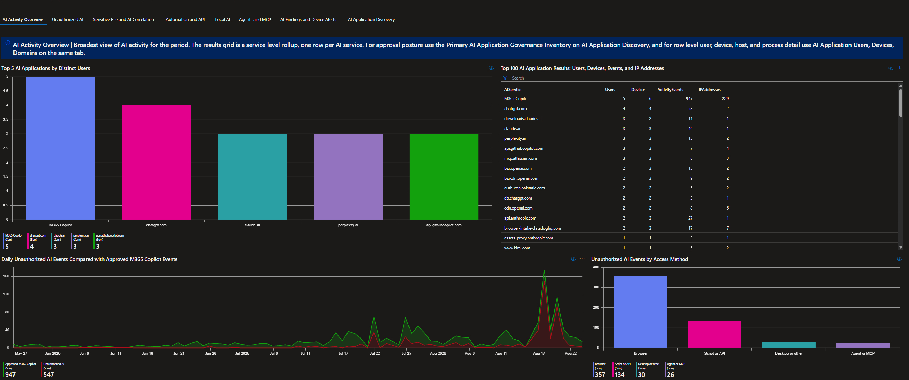
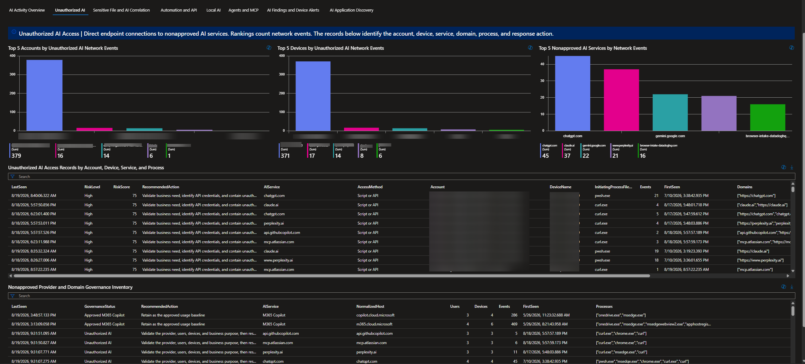
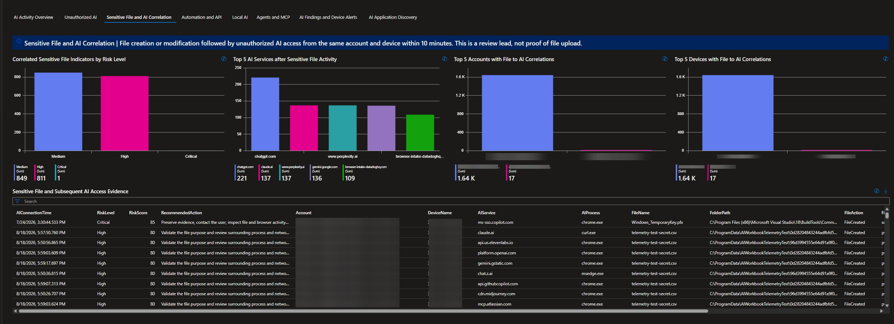
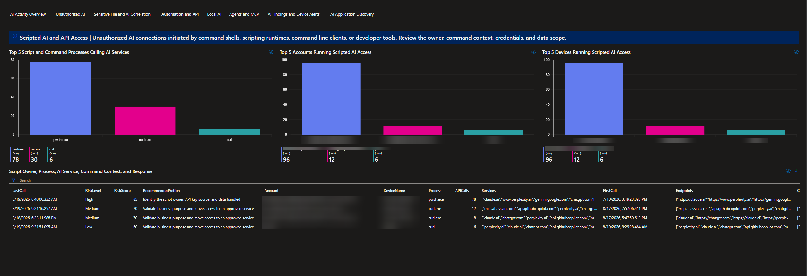
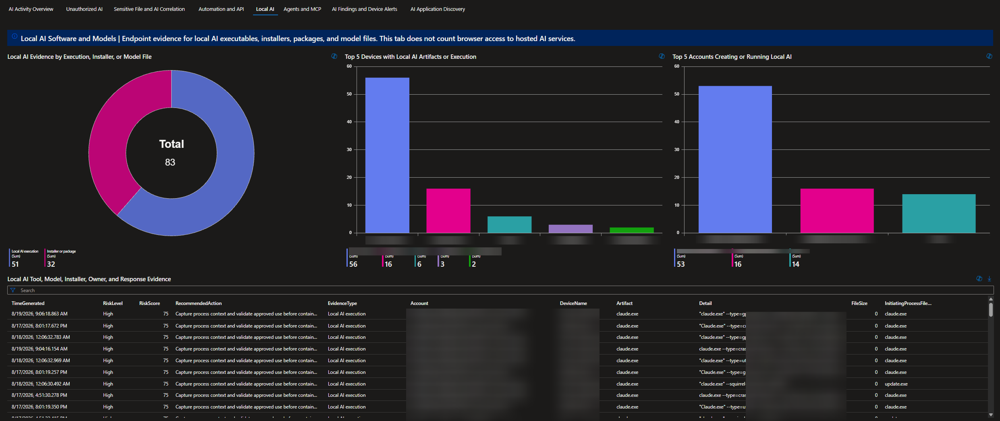
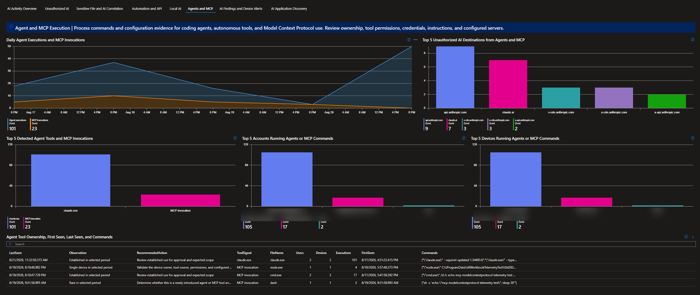
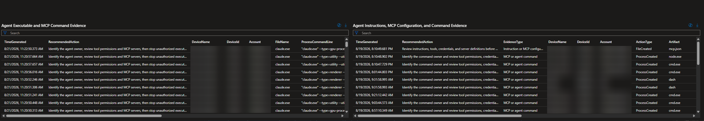
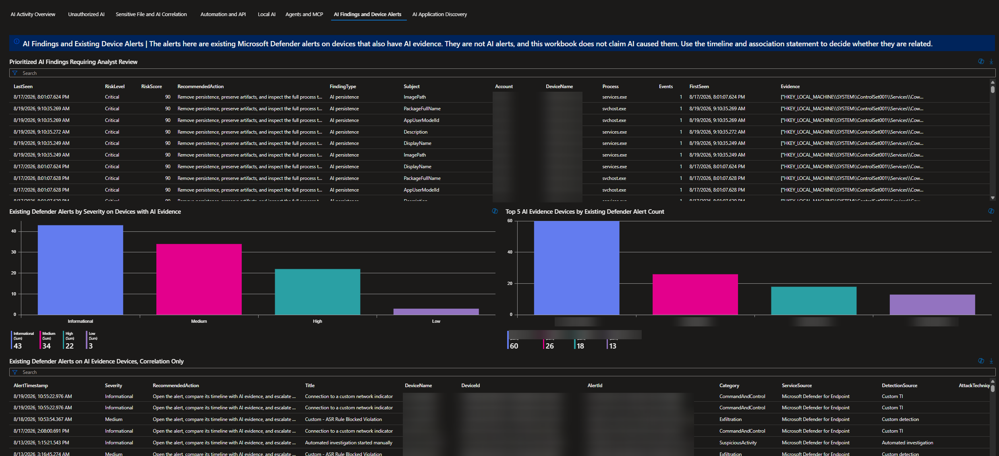
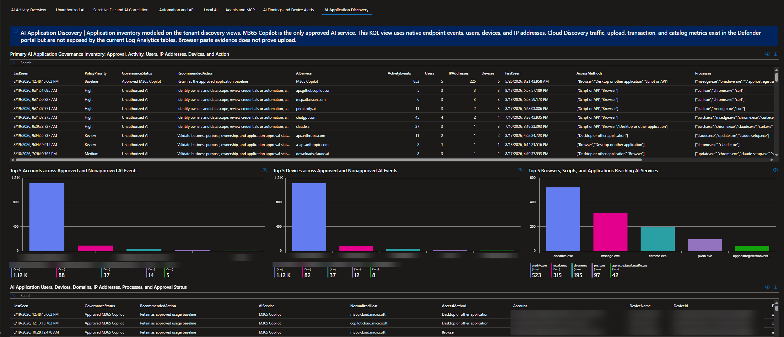
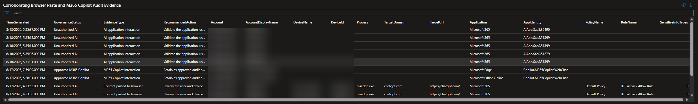

# AI Activity and Exposure Investigation Workbook

AI activity moves through browsers, scripts, APIs, local tools, and agents, often without a single investigation path. This Microsoft Sentinel workbook shows who used which AI service, from what device, how it was accessed, and when and where the activity occurred across MDE onboarded Windows, macOS, and Linux devices. It separates approved Microsoft 365 Copilot from nonapproved activity and connects users, devices, domains, processes, files, MCP evidence, and Defender alerts so analysts can quickly determine why an event needs review. A maintained AI domain catalog strengthens coverage by mapping raw network destinations to recognized providers as services and domains evolve. The catalog is reference data, sourced from the MIT licensed [v2fly domain list community](https://github.com/v2fly/domain-list-community), not a replacement for MDE or cloud application telemetry. When refreshed, it brings current provider and domain mappings into the workbook so analysts can recognize API endpoints, delivery domains, web applications, and agent or MCP infrastructure that fixed hand curated lists can miss as providers add new services, aliases, APIs, and supporting domains.

## What This Package Contains

| File | Purpose |
| --- | --- |
| [`deployment/Cross-Platform-AI-Activity.workbook`](deployment/Cross-Platform-AI-Activity.workbook) | Importable Microsoft Sentinel workbook definition |
| [`support/AI-Domain-Catalog.json`](support/AI-Domain-Catalog.json) | MIT licensed v2fly catalog snapshot with provider and domain metadata |
| [`support/Invoke-AIWorkbookTelemetry.ps1`](support/Invoke-AIWorkbookTelemetry.ps1) | Generates bounded test telemetry on authorized Windows test devices |

## Scope And Guardrails

The workbook identifies activity that matches known artificial intelligence domains, browser traffic, process names, script activity, local model artifacts, agent tools, MCP activity, sensitive file indicators, and existing Defender alerts.

A network match is an investigation signal. It is not proof that a user entered a prompt, received an answer, or transferred a specific document. `CloudAppEvents` paste records show that a paste action was observed, but the Sentinel event does not expose the literal clipboard text. Evidence collection in Microsoft Purview may provide a separate evidence path when it was enabled before the event.

Microsoft 365 Copilot is represented as the approved service in the workbook. Approval is a policy classification in this workbook, not a claim that every event is risk free.

### Domain Catalog Refresh

The AI domain catalog is baked into the queries at build time, not read at runtime. [`support/Build-CrossPlatformAIActivity.ps1`](support/Build-CrossPlatformAIActivity.ps1) fetches the current provider and domain mappings, writes them as inline lists inside each query, and produces the `.workbook` file and `azuredeploy.json`. Editing [`support/AI-Domain-Catalog.json`](support/AI-Domain-Catalog.json) or the live source does nothing to a deployed workbook until you rebuild and redeploy. There is no runtime lookup and no automatic refresh. When the build runs, it pulls the catalog live from the v2fly source and falls back to the cached JSON if the network is unavailable, so the domain set can shift between builds independent of any structural change.

### Coverage Caveats

The endpoint views depend on `DeviceNetworkEvents.RemoteUrl` being populated by MDE. The workbook does not see AI activity when the destination host is hidden, for example encrypted SNI or ECH, connections made by IP address only, or traffic sent through a forwarding proxy that rewrites the destination. It also matches on host, so a provider that serves from an unlisted domain is missed until the catalog is refreshed. Coverage is limited to MDE onboarded Windows, macOS, and Linux devices, so unmanaged, BYOD, and mobile devices are not represented. Treat gaps in the tabs as unknown, not as an absence of activity.

### Main Tables

| Table | Used for |
| --- | --- |
| `DeviceNetworkEvents` | Remote URLs, IP addresses, processes, devices, and initiating accounts |
| `DeviceProcessEvents` | Process creation, command lines, process owners, and agent or MCP evidence |
| `DeviceFileEvents` | Installer, model, extension, sensitive file, and local AI artifacts |
| `DeviceRegistryEvents` | Local configuration and persistence indicators |
| `CloudAppEvents` | Cloud application activity, browser paste records, policy metadata, and sensitive information classifications |
| `AlertInfo` | Existing Defender alerts and severity |
| `AlertEvidence` | Device and evidence correlation for existing alerts |

## Filters

The workbook provides global time, device, account, and tab controls.

| Control | Enter |
| --- | --- |
| Time range | The period to investigate |
| Device Name | The MDE `DeviceName`, such as `workstation-01`, `server-01.example.test`, or `linux-host-01` |
| Account | The account UPN or account name, such as `user@contoso.com` or `Administrator` |
| Tab | The investigation view to display |

The device and account filters are text filters. They are not identity pickers. Use the exact value shown in the result tables. MDE `DeviceId`, Entra `AadDeviceId`, Azure resource identifiers, and Entra `AccountObjectId` are shown in identity detail panels where available.

## Tab Guide

### 1. AI Activity Overview

**Purpose:** Establish the broadest view of AI activity across the selected period, showing the providers, users, devices, IP addresses, and access methods that drive exposure. Use it to identify spikes, prioritize the services with the widest reach, and pivot into the focused investigation tabs.

| Panel | What it shows | Analyst use |
| --- | --- | --- |
| Top 5 AI Applications by Distinct Users | Applications ranked by distinct observed users | Identify the services with the widest user reach |
| Top 100 AI Application Results: Users, Devices, Events, and IP Addresses | Detailed application results with affected identities and infrastructure | Pivot from a service to users, devices, events, and addresses |
| Daily Unauthorized AI Events Compared with Approved M365 Copilot Events | Daily comparison of nonapproved activity and approved Copilot activity | Identify spikes, policy changes, or unusual periods |
| Unauthorized AI Events by Access Method | Browser, Script or API, Desktop or other, and a dedicated Agent or MCP category | Decide whether the next investigation step belongs in browser, script, agent, or network telemetry |

**Review sequence:** Start with the top application chart, select the highest volume service, then use the detailed results to identify the accounts and devices. Move to Unauthorized AI or AI Application Discovery for identity and domain detail.

### 2. Unauthorized AI

**Purpose:** Focus on nonapproved AI services by connecting network activity to accounts, devices, processes, and destination domains. Use it to validate business purpose, identify repeated or scripted use, and prioritize governance review or containment.

| Panel | What it shows | Analyst use |
| --- | --- | --- |
| Top 5 Accounts by Unauthorized AI Network Events | Accounts associated with nonapproved network events | Prioritize user review |
| Top 5 Devices by Unauthorized AI Network Events | Devices with the highest nonapproved network volume | Prioritize device timeline review |
| Top 5 Nonapproved AI Services by Network Events | Services and domains with the most network events | Identify the main exposure destinations |
| Unauthorized AI Access Records by Account, Device, Service, and Process | Detailed access records joining user, device, service, process, and URL context | Build an investigation timeline |
| Nonapproved Provider and Domain Governance Inventory | Provider, domain, approval state, activity, users, devices, and response context | Review domain classification and governance coverage |

**Important interpretation:** A network event can represent a browser request, application request, background request, or service dependency. Review the initiating process and user fields before assigning intent.

### 3. Sensitive File and AI Correlation

**Purpose:** Identify time bounded cases where sensitive file activity is followed by AI access, giving analysts a focused lead across the user, device, process, file, and destination service. Use these correlations to prioritize evidence preservation, validate business need and data handling, and determine whether containment or DLP review is warranted; correlation alone does not prove file upload.

| Panel | What it shows | Analyst use |
| --- | --- | --- |
| Correlated Sensitive File Indicators by Risk Level | Risk scored file activity correlated with later AI access | Start with high risk correlations |
| Top 5 AI Services after Sensitive File Activity | Services contacted after a sensitive file event | Identify possible transfer destinations |
| Top 5 Accounts with File to AI Correlations | Accounts connected to both file activity and AI access | Prioritize account review |
| Top 5 Devices with File to AI Correlations | Devices connected to both activities | Pivot to device timeline and containment decisions |
| Sensitive File and Subsequent AI Access Evidence | Detailed file, account, device, service, timing, and response fields | Preserve evidence and document the correlation |

**Review sequence:** Confirm the file event first, check the correlation time window, verify the initiating account and process, then review whether the destination was approved. Do not infer that the file content was uploaded unless an upload event or Purview evidence confirms it.

### 4. Automation and API

**Purpose:** Identify AI access initiated by scripts, command shells, automation, and API clients, with the command context needed to understand how the connection was made. Use it to investigate ownership, credentials, data handling, and whether the automation should be approved, remediated, or contained.

| Panel | What it shows | Analyst use |
| --- | --- | --- |
| Top 5 Script and Command Processes Calling AI Services | Script and command processes associated with AI network events | Identify automation tools and interpreters |
| Top 5 Accounts Running Scripted AI Access | Accounts launching scripted access | Assign ownership and review authorization |
| Top 5 Devices Running Scripted AI Access | Devices with scripted AI activity | Scope the host investigation |
| Script Owner, Process, AI Service, Command Context, and Response | Detailed process owner, command line, service, endpoint, and response guidance | Capture command context and decide remediation |

**Command line caution:** Command lines can contain secrets, tokens, file paths, or prompt material. Limit access to authorized investigators and redact sensitive values before sharing screenshots or tickets.

### 5. Local AI

**Purpose:** Identify local AI executables, installers, model files, and local web interfaces that may not create obvious cloud service activity. Use it to distinguish file artifacts from actual execution, confirm ownership, and determine whether local AI use is permitted or requires review.

| Panel | What it shows | Analyst use |
| --- | --- | --- |
| Local AI Evidence by Execution, Installer, or Model File | Local tool execution, installer artifacts, model files, and related activity | Find local AI presence even without remote AI traffic |
| Top 5 Devices with Local AI Artifacts or Execution | Devices with the most local AI evidence | Prioritize host review |
| Top 5 Accounts Creating or Running Local AI | Accounts associated with local AI artifacts or execution | Assign ownership |
| Local AI Tool, Model, Installer, Owner, and Response Evidence | Detailed tool, model, installer, owner, and response fields | Document the local AI investigation |

**Important interpretation:** File presence alone does not prove execution. Use process events, execution timestamps, hashes, and user context to distinguish an installer download from a running local model.

### 6. Agents and MCP

**Purpose:** Identify agent frameworks, agent tools, MCP clients, MCP server commands, instruction files, and configuration evidence that shows how AI tools are connected and invoked. Use it to review ownership, configured servers, permissions, credentials, and the scope of agent activity before allowing or escalating its use.

| Panel | What it shows | Analyst use |
| --- | --- | --- |
| Daily Agent Executions and MCP Invocations | Daily agent process executions compared with MCP invocations | Spot volume trends and unusual spikes in agent and MCP activity |
| Top 5 Unauthorized AI Destinations from Agents and MCP | Nonapproved AI destinations reached by agent and MCP processes | Identify where agents and MCP are sending traffic |
| Top 5 Detected Agent Tools and MCP Invocations | Tools and MCP related activity ranked by event volume | Identify the most common agent paths |
| Top 5 Accounts Running Agents or MCP Commands | Accounts associated with agent or MCP activity | Assign ownership and authorization review |
| Top 5 Devices Running Agents or MCP Commands | Devices associated with agent or MCP activity | Scope device investigation |
| Agent Tool Ownership, First Seen, Last Seen, and Commands | Ownership, timing, command, and tool context | Build a repeat activity timeline |
| Agent Executable and MCP Command Evidence | Executable, command line, process owner, and endpoint evidence | Determine how the tool was launched |
| Agent Instructions, MCP Configuration, and Command Evidence | Instruction files, configuration files, and command evidence | Review tool permissions and connected services |

**Important interpretation:** A request to an MCP URL is not by itself proof of a successful MCP session. Confirm the initiating process, account, command, authentication result, and server endpoint where available.

### 7. AI Findings and Device Alerts

**Purpose:** Consolidate AI evidence that needs analyst attention and correlate it with existing Defender alerts on the same devices. Use it to rank the investigation queue, compare timelines, and decide whether the signals are related before escalating or containing a device.

| Panel | What it shows | Analyst use |
| --- | --- | --- |
| Prioritized AI Findings Requiring Analyst Review | Risk scored findings with evidence and recommended action | Establish the investigation queue |
| Existing Defender Alerts by Severity on Devices with AI Evidence | Existing alerts on devices that also show AI evidence | Identify cases with related security context |
| Top 5 AI Evidence Devices by Existing Defender Alert Count | Devices ranked by alert count within the AI evidence set | Focus on devices with multiple signals |
| Existing Defender Alerts on AI Evidence Devices, Correlation Only | Alert details correlated to AI evidence devices | Avoid treating correlation as causation |

**Review sequence:** Review the highest priority finding, open the related device and account evidence, compare event timing with existing alerts, and record whether the relationship is confirmed, possible, or unrelated.

### 8. AI Application Discovery

**Purpose:** Provide the broadest approved versus nonapproved AI application inventory and corroborate browser paste audit records with user, device, process, domain, and policy context. Use it to compare approved Microsoft 365 Copilot activity with nonapproved services, assess governance gaps, and prioritize follow up without treating a paste event as proof of upload.

| Panel | What it shows | Analyst use |
| --- | --- | --- |
| Primary AI Application Governance Inventory: Approval, Activity, Users, IP Addresses, Devices, and Action | Main service inventory with approval and activity context | Review governance posture |
| Top 5 Accounts across Approved and Nonapproved AI Events | Users across both Copilot and nonapproved activity | Find the highest total AI activity users |
| Top 5 Devices across Approved and Nonapproved AI Events | Devices across both activity classes | Compare device level behavior |
| Top 5 Browsers, Scripts, and Applications Reaching AI Services | Client applications reaching AI services | Distinguish browser, script, and application access |
| AI Application Users, Devices, Domains, IP Addresses, Processes, and Approval Status | Detailed user, device, domain, address, process, and approval view | Pivot across the full evidence chain |
| Corroborating Browser Paste and M365 Copilot Audit Evidence | Paste actions, destination, policy, rule, sensitive information classifications, and evidence references | Corroborate browser paste activity |

**Paste evidence boundary:** The current Sentinel event records the paste action and related metadata. It does not expose the literal clipboard text. Purview evidence collection is a separate evidence source and must have been configured before the event.

## How To Deploy

Use one of the deployment buttons below.

## Prevention Measures

[Prevention Measures Based on Workbook](https://github.com/johnB007/Defender_XDR/blob/main/Workbooks/Cross-Platform-AI-Activity-Workbook/support/Prevention-Measures-Based-on-Workbook.md) provides the companion control review for destination, data, application, browser, API, MCP, and identity controls.

## License And Attribution

The workbook source and scripts remain subject to the repository license. The AI domain catalog includes data derived from the MIT licensed [v2fly domain list community](https://github.com/v2fly/domain-list-community). The catalog is a detection aid and does not endorse blocking, proxying, or restricting any listed domain.
